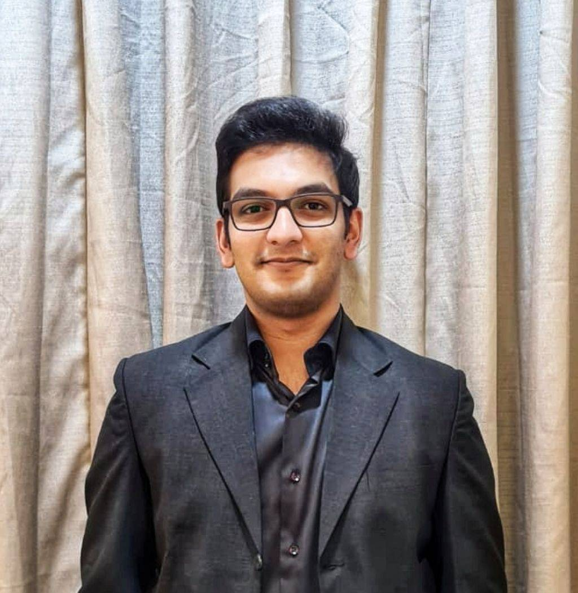

---
# Feel free to add content and custom Front Matter to this file.
# To modify the layout, see https://jekyllrb.com/docs/themes/#overriding-theme-defaults

layout: page
---

              

Hi, I'm **Abhijith** and I build machine learning systems at **[Glance](https://www.glance.com/)**. I function in a full-stack (ML) capacity where I not only build ML models, but also work on real-time & scalable systems, and the infrastructure on which these models are deployed. This involves working with distributed computing, streaming and real-time systems for MLOps and ML engineering.

I've focused on Natural Language Processing and Computer Vision, to solve Content Creation and Generation tasks at scale. Currently working on Recommendation Systems in an online learning and online prediction environment.

Elsewhere, I am an [online Master's student at Georgia Tech](https://omscs.gatech.edu/) specializing in machine learning.
